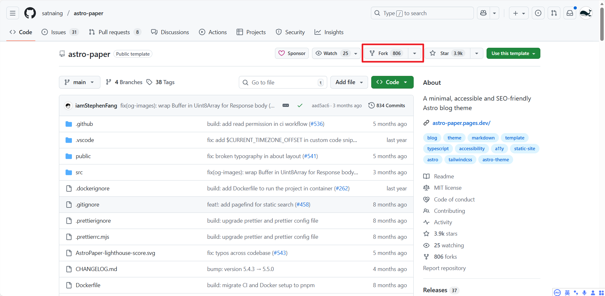

### 1. Fork仓库

（1）首先访问astropaper主题开源仓库[satnaing/astro-paper](https://github.com/satnaing/astro-paper)

（2）fork开源仓库至自己的github，得到自己的仓库[czy363/czy_astro_paper](https://github.com/czy363/czy_astro_paper)（仓库名可以自定义，例如我的仓库名称改为czy_astro_paper）

 

### 2.Vercel注册绑定自己的astro仓库

（1）通过github注册账号--->install导入github的astro仓库,import--->Deploy部署仓库--->vercel会分配一个域名用于访问生成页面（但是国内不能访问）

（可能出错，需要创建登录验证添加环境变量，具体参考bilibili视频[【零成本】搭建一个属于自己的Astro博客网站](https://www.bilibili.com/video/BV18eCpYcEAk/?spm_id_from=333.337.search-card.all.click&vd_source=a65c3b45fdf7ce45d3ec6422024bc43c)）


### 3.购买国内的域名，DNS解析，vercel添加域名

 

### 4.本地安装编译和渲染工具，用于本地验证

（1）安装node-js，安装完成后 node -v 查看版本

（2）安装pnpm

```bash
# 1. 指定 npm 全局目录到用户家目录
npm config set prefix '~/.npm-global'

# 2. 把可执行路径加入 PATH（一次性）
echo 'export PATH=~/.npm-global/bin:$PATH' >> ~/.bashrc
source ~/.bashrc

# 3. 再装 pnpm（无需 sudo）
npm i -g pnpm --registry=https://registry.npmmirror.com

# 4. 回到项目目录（已在此目录可跳过）
cd ~/blog/czy_astro_paper

# 5. 一键安装（并行 + 国内镜像 + 二进制加速）
pnpm config set registry https://registry.npmmirror.com
pnpm install
```

(3) 执行 pnpm dev 就能生成html页面用于验证


### 5.git push 不成功解决办法

这个错误：

```bash
fatal: 无法访问 'https://github.com/czy363/czy_astro_paper.git/ '：gnutls_handshake() failed: The TLS connection was non-properly terminated.
```

说明 Git 在尝试通过 HTTPS 与 GitHub 建立 TLS 连接时失败了，通常是由于本地网络、代理、TLS 库（gnutls）或 Git 配置的问题。

✅ 1. **换用 SSH 协议（推荐）**

HTTPS 容易受网络或 TLS 库影响，SSH 更稳定。

**步骤：**

```bash
git remote set-url origin git@github.com:czy363/czy_astro_paper.git
```

然后确保你已经配置了 SSH key 并添加到 GitHub：
```bash
ssh-keygen -t ed25519 -C "your_email@example.com"
cat ~/.ssh/id_ed25519.pub
```
把输出内容添加到 GitHub → Settings → SSH and GPG keys → New SSH key。

测试连接：
```bash
ssh -T git@github.com
```

#### ✅ 2. **更新 Git 和 gnutls（如果必须用 HTTPS）**
旧版本的 Git 或 gnutls 可能有 bug。

```bash
sudo apt update
sudo apt install git gnutls-bin
```

#### ✅ 3. **关闭代理或检查网络**
如果你用了代理（如 Clash、V2Ray、Proxifier），尝试关闭它们：

```bash
git config --global --unset http.proxy
git config --global --unset https.proxy
```

然后重试：
```bash
git push
```
