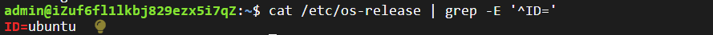
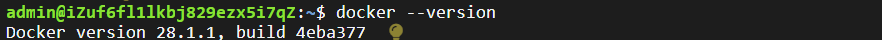
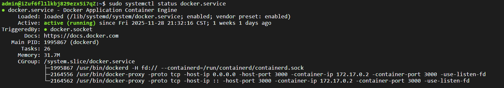
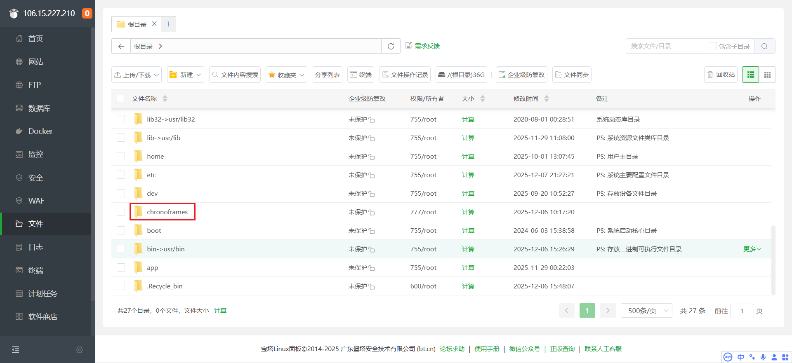
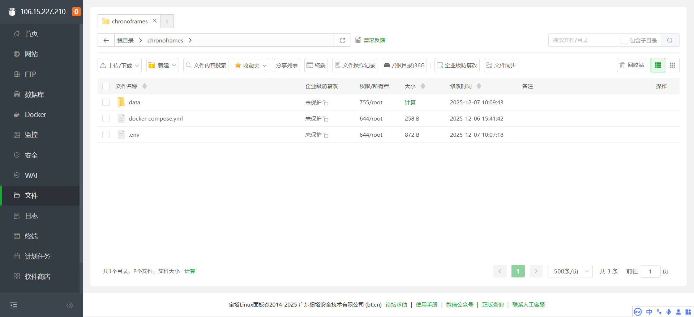
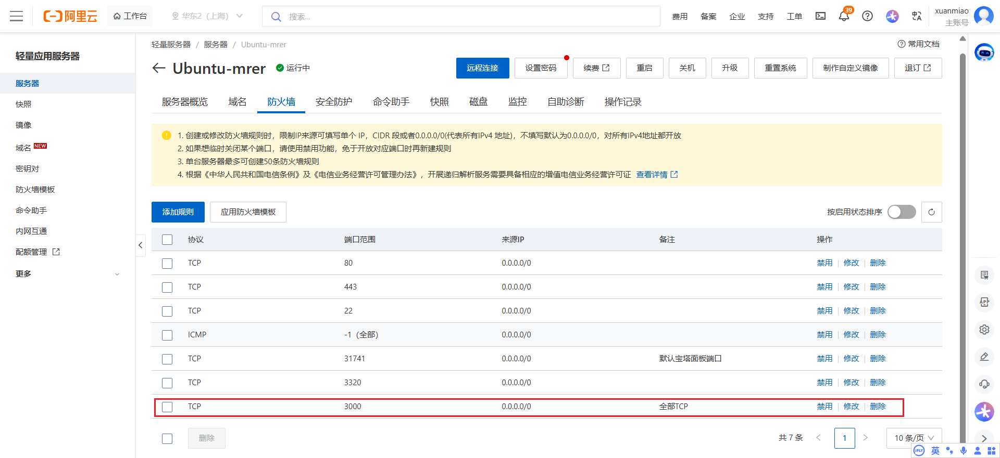
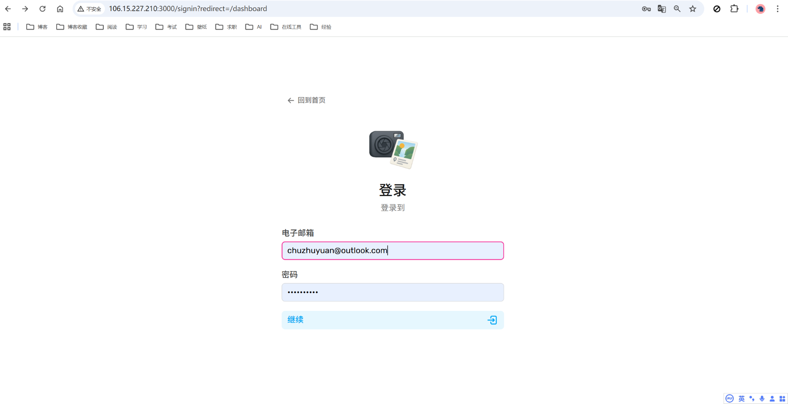
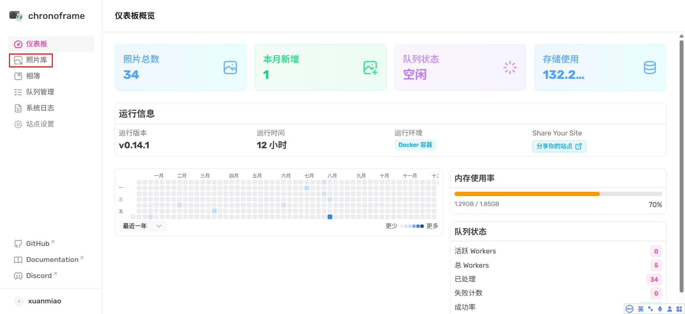
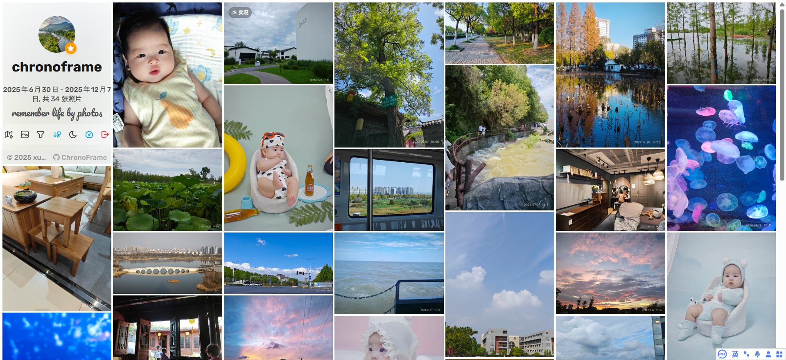

### 1. 安装docker

#### （1）远程登录服务器，查看阿里云服务器系统为ubuntu

```bash
cat /etc/os-release | grep -E '^ID='
```

 

#### （2）添加Docker软件包源 + 安装Docker社区版本

```bash
#更新包管理工具
sudo apt-get update
#添加Docker软件包源
sudo apt-get -y install apt-transport-https ca-certificates curl software-properties-common
sudo curl -fsSL http://mirrors.cloud.aliyuncs.com/docker-ce/linux/ubuntu/gpg | sudo apt-key add -
sudo add-apt-repository -y "deb [arch=$(dpkg --print-architecture)] http://mirrors.cloud.aliyuncs.com/docker-ce/linux/ubuntu $(lsb_release -cs) stable"
#安装Docker社区版本，容器运行时containerd.io，以及Docker构建和Compose插件
sudo apt-get -y install docker-ce docker-ce-cli containerd.io docker-buildx-plugin docker-compose-plugin
```

#### （3）启动Docker并设置开机自启

```bash
#启动Docker
sudo systemctl start docker

#设置Docker守护进程在系统启动时自动启动
sudo systemctl enable docker
```

#### （4）配置镜像源

```bash
sudo mkdir -p /etc/docker
sudo tee /etc/docker/daemon.json <<-'EOF'
{
  "registry-mirrors": ["https://rxoe304z.mirror.aliyuncs.com"]
}
EOF
sudo systemctl daemon-reload
sudo systemctl restart docker
```

#### （5）验证docker是否安装成功

###### 查看版本

```bash
docker --version
```

 

###### 检查 Docker 服务状态

```bash
sudo systemctl status docker.service
```

 

### 2.安装docker-compose

```bash
sudo apt-get -y install docker-compose-plugin
```


### 3. 拉取chronoframes docker镜像

```bash
# 从 GHCR 拉取（推荐）
docker pull ghcr.io/hoshinosuzumi/chronoframe:latest
```


### 4. 通过宝塔面板创建chronoframes目录，并且在其中创建data目录，docker-compose.yml和.env文件



 


**docker-compose.yml** 如下

```yaml
services:
  chronoframe:
    image: ghcr.io/hoshinosuzumi/chronoframe:latest
    container_name: chronoframe
    restart: unless-stopped
    ports:
      - '3000:3000'
    volumes:
      - ./data/storage:/app/data/storage
    env_file:
      - .env
```

**.env** 如下

```bash
# 邮箱密码 Admin email (必填)
CFRAME_ADMIN_EMAIL=chuzhuyuan@outlook.com

# Admin username (optional, default Chronoframe)
CFRAME_ADMIN_NAME=xuanmiao
# Admin password (optional, default CF1234@!)
CFRAME_ADMIN_PASSWORD=你设置的密码

# 存储路径 Storage provider（必填）(local, s3 or openlist )
NUXT_STORAGE_PROVIDER=local
NUXT_PROVIDER_LOCAL_PATH=/app/data/storage

# 会话密码 Session password （必填）(32‑char random string)
NUXT_SESSION_PASSWORD=XZgc7VYm0oZx9XlK4NMnjcc5xukMtmfXE5cke0cZwCA=

# 元数据 Site metadata (all optional)
NUXT_PUBLIC_APP_TITLE=chronoframe
NUXT_PUBLIC_APP_SLOGAN=remember life by photos
NUXT_PUBLIC_APP_AUTHOR=xuanmiao
NUXT_PUBLIC_APP_AVATAR_URL=https://czywordpress.oss-cn-shanghai.aliyuncs.com/%E5%BE%AE%E8%BD%AF%E5%A3%81%E7%BA%B8/2025-11-27_577473_17640302872101686.jpg

# 登录 （如果通过地址+端口访问，NUXT_ALLOW_INSECURE_COOKIE=true 必填）
NUXT_ALLOW_INSECURE_COOKIE=true
```


### 5. 创建并启动容器

```bash
docker run -d --name chronoframe -p 3000:3000 -v $(pwd)/data:/app/data --env-file .env ghcr.io/hoshinosuzumi/chronoframe:latest
```

```bash
如果需要修改配置，再重启容器，按照如下操作：

1. 先 docker ps 查看容器id;
2. docker stop container_id  停止容器运行
3. 修改配置文件
4. docker start container_id  重新启动容器

或者
1. docker stop container_id 停止容器运行
2. docker rm container_id 删除容器
3. docker run -d --name chronoframe -p 3000:3000 -v $(pwd)/data:/app/data --env-file .env  ghcr.io/hoshinosuzumi/chronoframe:latest  重新创建并启动容器
```


### 6. 阿里云服务器防火墙添加规则开放3000端口



 

### 7. 访问 服务器地址+3000端口，点击左侧头像进行登录 http://106.15.227.210:3000/

 

### 8. 头像下方点击蓝色控制台按钮，进入控制台仪表盘




### 9. 上传图片，最后显示效果如下

 

<div style="text-align: center; font-size: 24px; color: green; font-family: 'Microsoft YaHei', sans-serif;">END~</div>

📚 参考链接：

1. [ChronoFrame主页](https://chronoframe.bh8.ga/zh/)
1. [ChronoFrame画廊部署教程](https://mp.weixin.qq.com/s/C2udgzu3ixkzHYMpkxqbDA)
1. [ChronoFrame社区](https://github.com/HoshinoSuzumi/chronoframe/discussions)
